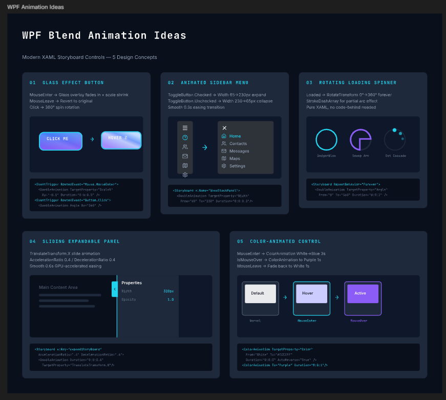
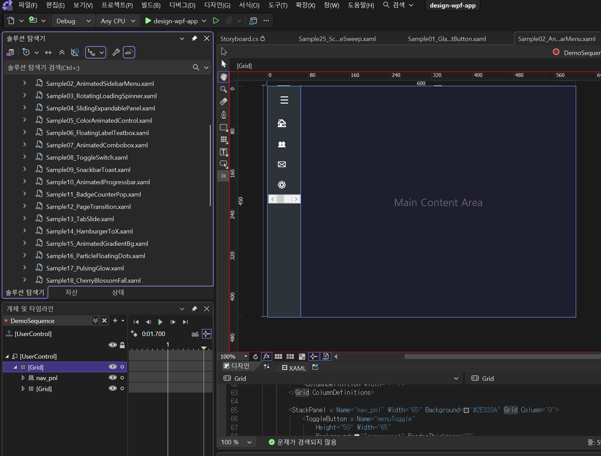

# Pencil Creator



**Look & Feel + Animation First Design** — A Claude Code project for designing and validating look & feel and animations before building web applications.
It provides 11+ (and growing) animatable controls out of the box, and with this design harness you can discover and add controls like the above using only prompts.

# MS Blend for Visual Studio



Pencil can implement animated web content using definition files alone.

Optionally, by using the **Blend tool** in addition,
you can control the detailed movements of animations more directly.
It serves as a **complement to Pencil's timeline & storyboard features**.

---

## Pencil Design Files (.pen)

The design artifacts of this project are managed as `.pen` files for the [Pencil](https://pencil.elpass.app/) editor.
Download the files below and open them in the Pencil editor to explore the animation templates and project designs.

| File | Description | Download |
|------|-------------|----------|
| WPF Animation Template | 12 CATs, 40+ technique card library | [`design/wpf-animation.pen`](design/wpf-animation.pen) |
| Publisher App Design | Web ZIP publisher app (4 screens + 12 animation guide cards) | [`projects/design/publisher-app.pen`](projects/design/publisher-app.pen) |

---

## Design-First Concept

The core philosophy of this project is **"Design before code, animation design before static design."**

```
+----------------------------------------------------------------+
|                    ANIMATION-FIRST DESIGN                       |
|                                                                 |
|  1. WPF Animation Research   DoubleAnimation, ScaleTransform,   |
|     (Case A)                 Easing, Storyboard pattern mining  |
|           |                                                     |
|           v                                                     |
|  2. Animation Template       wpf-animation.pen                  |
|     Library Build            10 CATs, 37 technique cards        |
|           |                                                     |
|           v                                                     |
|  3. Project Design           Static look & feel screens         |
|     (Case B)                 + Animation guides (separated!)    |
|           |                                                     |
|           v                                                     |
|  4. HTML Implementation      Convert to CSS/JS animations       |
|     (Case W)                 Apply WPF -> CSS mapping rules     |
|           |                                                     |
|           v                                                     |
|  5. Harness Evaluation       3-axis scoring + RPG experience    |
|     & Improvement                                               |
|           |                                                     |
|           v                                                     |
|        Iterate                                                  |
+----------------------------------------------------------------+
```

**Why design animations first?**

- Animations feel awkward when added later. You need to design **state transitions (Before -> After)** from the start for a natural UX.
- WPF Storyboard patterns are the best reference for explicitly defining animation properties (target, duration, easing).
- **Separating** static design from dynamic definitions allows animations to remain independent when the look & feel changes.

---

## Application Layout — Project Design Artifacts

### Publisher App (Web ZIP Publisher)

An application for uploading ZIP files to publish and manage websites.

**Static Design (4 screens):**

| Screen | Key Components |
|--------|---------------|
| Dashboard | 4 stat cards + published sites table |
| Upload | Drag & drop zone + progress bar + completed file list |
| Publish | Form (name/publisher/description/favicon) + validation + publish button |
| View Sites | 6 site card grid (3x2) + open in new window / delete |

**Animation Guide (4 categories, 12 cards):**

| Category | Card | WPF Technique | Target Element |
|----------|------|---------------|----------------|
| CAT-A Dashboard | Counter Roll-Up | DoubleAnimation + CubicEaseOut | Stat value text |
| | Staggered Row Entrance | TranslateY + Opacity Stagger | Table rows |
| | Skeleton Shimmer | GradientStop + Forever | Loading state |
| CAT-B Upload | Dropzone Pulse Glow | Opacity + Shadow AutoReverse | Dropzone border |
| | Progress Bar Gradient | Width DoubleAnimation | Progress fill |
| | File Card Slide-In | TranslateX + ElasticEase | Completed file cards |
| CAT-C Publish | Floating Label Input | Y + Scale + ColorAnimation | Input fields |
| | Validation Stagger Check | Scale + BounceEase | Validation items |
| | Publish Button Ripple | Ellipse Scale + Opacity | Publish button |
| CAT-D View Sites | Card Hover Scale + Lift | ScaleTransform + Shadow | Site cards |
| | Gradient Background Shift | PointAnimation + Forever | Card thumbnails |
| | Delete Bounce Shrink | BackEaseIn + Opacity | Delete action |

File: `projects/design/publisher-app.pen`

---

## WPF Animation Research Techniques

### Research -> Visualization Pipeline

WPF Storyboard/DoubleAnimation/Transform patterns are researched and **statically visualized** as Pencil design cards.

```
WebSearch XAML examples
    |
    v
Extract key properties
  - TargetProperty (Opacity, ScaleX, TranslateX...)
  - Duration, BeginTime
  - EasingFunction (CubicEaseOut, ElasticEase, BounceEase...)
  - RepeatBehavior, AutoReverse
    |
    v
Create Pencil card
  +------------------------------+
  | 1-1  FLOATING LABEL TEXTBOX  |  <- Number + Title
  |                               |
  | Focus -> Label Y^18px        |  <- Behavior description
  | Scale 75%, Color transition   |
  |                               |
  | +----------+  ->  +----------+|  <- Before -> After
  | | Username |      | Username ||
  | |          |      | #        ||
  | +----------+      +----------+|
  |                               |
  | <DoubleAnimation              |  <- XAML code
  |   TargetProperty="Y"         |
  |   To="-18" Duration="0.2"/>  |
  +------------------------------+
```

### Current Template Library

| Resource | Path | Scale |
|----------|------|-------|
| Animation Template | `design/wpf-animation.pen` | 12 CATs, 40+ cards |
| XAML Samples | `design/xaml/sample/*.xaml` | 27 standalone files |
| Research History | `design/xaml/research-history.md` | 20 sources/techniques recorded |
| **WPF App (for Blend)** | `design-wpf-app/` | **27 UserControls (Blend timeline editable)** |

**Category List:**

| CAT | Topic | Key Techniques |
|-----|-------|---------------|
| 1 | Data Input Controls | Floating Label, ComboBox, Toggle |
| 2 | Feedback & Notification | Snackbar, Progress Bar, Badge |
| 3 | Navigation & Transitions | Page Transition, Tab Slide, Hamburger Morph |
| 4 | Decorative & Background | Gradient BG, Particle Dots, Pulsing Glow |
| 5 | 3D Transform & Shape Morph | Flip Card, Morphing, Elastic Spring |
| 6 | Path & Trajectory | Path Follower, Parallax, Drag & Drop |
| 7 | Text & Sequential | Typewriter, Marquee, Staggered List |
| 8 | Interactive UI Controls | Ripple Button, Accordion, Tooltip |
| 9 | Data Visualization & Loading | Skeleton Shimmer, Circular Progress, Bar Chart |
| 10 | Ambient & Decorative FX | Wave Ripple, Breathing Pulse, Marching Ants |
| 11 | Celebration & Advanced | Confetti Burst, Zoom/Pinch, Animated Tooltip |
| 12 | Spring & Nature Particle | Cherry Blossom Fall, Petal Scatter, Breeze Sway |

---

## 3-Case Harness Workflow

### Case A: WPF Template Enrichment

```bash
> "Research WPF templates and enrich them"
> "Research WPF Elastic/Spring effects and add them to wpf-animation.pen"
```

Directly researches WPF XAML via WebSearch and adds cards to `design/wpf-animation.pen`.

| Evaluation Axis | Max Score | Key Criteria |
|-----------------|-----------|-------------|
| A1 Research Novelty | 35 | Were new techniques added without duplicating existing ones? |
| A2 Visualization Expressiveness | 35 | Is the Before->After transition intuitive? |
| A3 Metadata Completeness | 30 | Are the XAML code and sources accurate? |

### Case B: Project Design (Design-First)

```bash
> "Design a publisher app in Pencil referencing wpf-animation effects"
> "Design a shopping mall admin page referencing wpf-animation"
```

Uses wpf-animation.pen as a **reference library** to create separated static look & feel + animation guide designs.

| Evaluation Axis | Max Score | Key Criteria |
|-----------------|-----------|-------------|
| B1 Requirements Fidelity | 35 | Were all required pages/features designed? |
| B2 Animation Guide Richness | 35 | Diverse WPF technique mapping + target specification |
| B3 Design Quality & Separation | 30 | Look & feel consistency + static/dynamic separation |

### Case W: HTML Implementation

```bash
> "Create HTML referencing the Pencil design"
> "Implement the publisher-app.pen design as a web page"
```

Converts the .pen file's static design + animation guide into HTML/CSS/JS.

| Evaluation Axis | Max Score | Key Criteria |
|-----------------|-----------|-------------|
| W1 Design Coverage | 35 | How much of the .pen elements were reflected? |
| W2 Animation Fidelity | 35 | Were the animation guides actually implemented? |
| W3 Creative Extension | 30 | Were interactions beyond the design added? |

### Pipeline Bonus

| Path | Condition | XP Bonus |
|------|-----------|----------|
| A -> B | Both 60+ pts | x1.2 |
| A -> W | Both 60+ pts | x1.2 |
| B -> W | Both 60+ pts | x1.3 |
| A -> B -> W | All 60+ pts | x1.5 |

---

## RPG System

Earn XP upon task completion and level up.

```
Earned XP = Base XP (score x 10) x Grade multiplier (A:x5 B:x3 C:x1 D:x0.5) x Type multiplier (x1.2)

Grades: A (80-100) B (60-79) C (40-59) D (0-39)

Current Status: Lv.20 "Keyboard Warrior" | Total XP: 12,708
```

---

## Skill Configuration

| Skill | Role | Trigger |
|-------|------|---------|
| `harness-usage` | Execute Case A/B/W + evaluation | "Enrich WPF template", "Design it", "Create HTML" |
| `pencil-design` | Pencil MCP diagrams/blueprints + WPF App migration | "Draw architecture in Pencil", "Migrate XAML" |
| `harness-creator` | Harness structure improvement | "Upgrade the harness" |

---

## Directory Structure

```
pencil-creator/
├── .claude/skills/
│   ├── pencil-design/         <- Pencil MCP design skill
│   ├── harness-usage/         <- Case A/B/W workflow + evaluation
│   └── harness-creator/       <- Harness structure improvement
├── design/
│   ├── wpf-animation.pen      <- WPF animation template (10 CATs, 37 cards)
│   └── xaml/
│       ├── research-history.md <- WPF research history
│       ├── sample/*.xaml       <- 17 XAML samples
│       └── output/sample{N}/   <- HTML output
├── design-wpf-app/
│   ├── design-wpf-app.slnx    <- Open in Blend for Visual Studio
│   ├── migrated/               <- 27 converted UserControls (Blend timeline editable)
│   ├── db/migration-db.json    <- Migration status DB (v2 schema)
│   └── docs/                   <- Core conversion guide
├── projects/
│   ├── design/*.pen            <- Per-project designs (static + animation guide)
│   └── prompt/                 <- Project prompt history
├── harness/
│   ├── knowledge/              <- Evaluation criteria (design-craft.md)
│   ├── agents/                 <- Evaluation agents
│   ├── engine/                 <- RPG rules + state model
│   ├── logs/                   <- Work logs + RPG state
│   └── docs/                   <- Version change history
├── CLAUDE.md                   <- Claude Code project instructions
└── README.md
```

---

## WPF App Migration (for Blend Editing)

A project that converts 27 collected XAML animations into a WPF App editable via **Blend for Visual Studio** timeline.
When implementing animations on other platforms (web, mobile), use the Blend timeline to visually inspect keyframes and easing.

### Usage

```bash
# Open in Blend
design-wpf-app/design-wpf-app.slnx   # <- Open this file in Blend for Visual Studio

# Runtime execution (Gallery Viewer)
cd design-wpf-app && dotnet run

# Request new XAML migration (Claude Code)
> "Migrate XAML to WPF app"
> "Convert design/xaml/sample/28-xxx.xaml to Blend-compatible format"
```

### Blend Timeline Usage

1. Open `migrated/Sample{NN}_*.xaml` files in Blend
2. Select a Storyboard from the **timeline dropdown** (GlassHoverIn, SpinnerRotate, etc.)
3. Select **DemoSequence** to play the full animation flow at once
4. Click keyframes to modify easing, timing, and values

### Project Structure

```
design-wpf-app/
├── design-wpf-app.slnx     <- Open in Blend
├── MainWindow.xaml          <- Left navigation + right content viewer
├── migrated/                <- 27 converted UserControls
├── db/migration-db.json     <- Migration status DB (v2)
└── docs/animation-migration-guide.md  <- Core conversion guide
```

---

## Roadmap

This project will **continuously add sample web pages alongside harness design upgrades**.

- [ ] **Publisher App HTML Implementation** (Case W) — Implement publisher-app.pen design + 12 animation guides as an actual web page
- [ ] **WPF Template Expansion** (Case A) — Add CAT 10+ (Scroll-driven Animation, View Transition, etc.)
- [ ] **New Project Designs** (Case B) — Various app layouts: dashboards, e-commerce, SaaS landing pages, and more
- [ ] **Harness v3.0** — Auto-connect Case B->W pipeline, add accessibility evaluation axis
- [ ] **Design System** — Reusable component library shareable across projects

> All samples follow the **Animation-First Design** principle: look & feel and animation guides are designed first, then implemented.

---

## Getting Started

```bash
# 1. Prerequisites
# Install Claude Code + Pencil

# 2. Open the project
cd pencil-creator
claude

# 3. Start your first task
> "Design a portfolio app in Pencil referencing wpf-animation"  # Case B
> "Research and enrich WPF templates"                            # Case A
> "Create HTML referencing the Pencil design"                    # Case W
> "Migrate XAML to WPF app"                                      # Blend editing
> "What is the harness?"                                         # Usage guide
```

---

## License

MIT

---

> **[Korean / 한국어 README](README-KR.md)**
